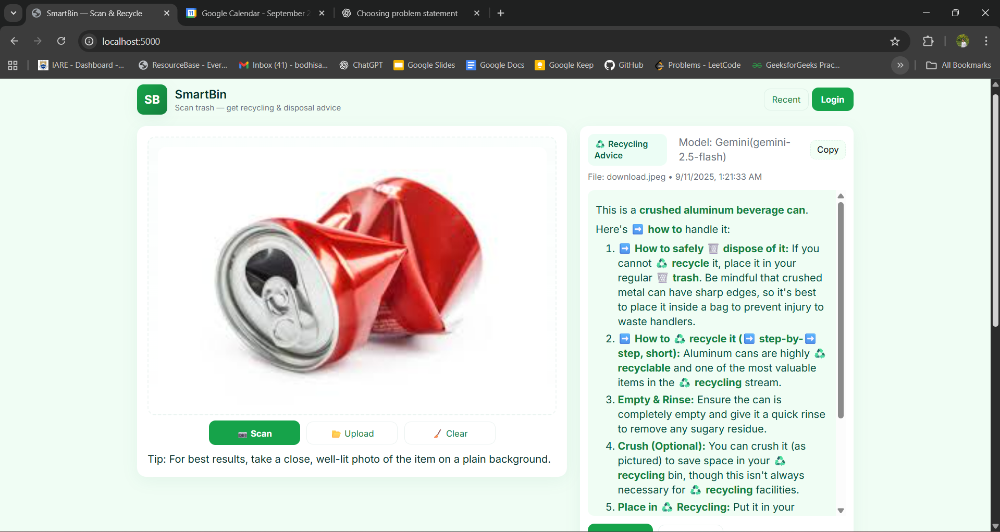
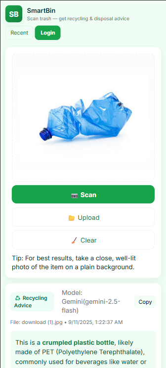
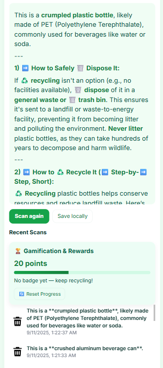

# ♻️ SmartBin

SmartBin is a full-stack web app that helps users identify trash types using **AI (Gemini API)** and provides **step-by-step recycling & disposal advice**. It also features **gamification & rewards** to encourage eco-friendly habits.

---

## ✨ Features
- 📷 Upload or scan trash images (camera supported)
- 🤖 AI-powered trash classification + recycling guidance
- 🏆 Gamification system with points & reset option
- 🕒 Recent scans history (local + server)
- ⚡ Modern, responsive, judge-friendly UI

---

## 📸 Screenshots
### **Desktop view**



### **Mobile view**

---

 

---

## ⚙️ Setup & Run Locally
```bash
# Clone repo
git clone https://github.com/Bodhisattva-Duduka/SmartBin-CodeStromEco-Hackathon.git
cd SmartBin-CodeStromEco-Hackathon

# Install dependencies
npm install

# Create .env file and add your Gemini API key
echo "GEMINI_API_KEY=your_api_key_here" > .env

# Run server
npm run dev
```

Then open 👉 http://localhost:5000

---

## 📂 Project Structure
```
smartbin/
│── public/           # Frontend (HTML, CSS, JS, assets)
│── routes/           # Backend API routes
│── data/             # Local DB (db.json)
│── uploads/          # Temp uploads
│── server.js         # Express server entry
│── .env              # API keys
│── README.md
```

---

## 💡 Future Improvements
- 🌍 Multi-language support
- 📊 Analytics dashboard for waste trends
- 🎁 Unlockable rewards for eco-friendly actions

---

## 📝 License
MIT License © 2025 SmartBin Team
